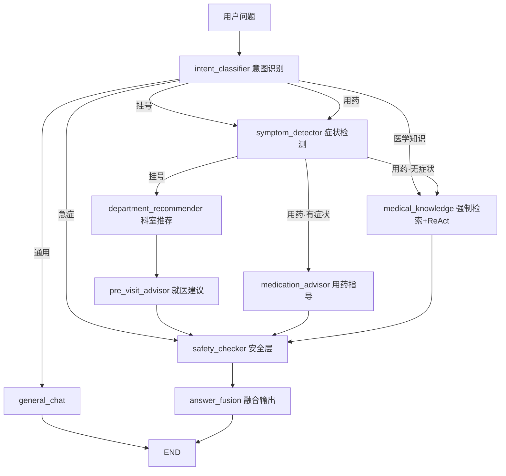

# 智慧问诊Agent系统（SmartMedicalConsultation）

基于**医疗知识图谱（Neo4j）+ 向量检索（FAISS / BGE-M3）+ LangGraph 多 Agent**的医疗问诊问答系统。后端 FastAPI 同时托管 API 与 Vue 前端静态文件，**单进程部署**，唯一外部依赖是 Neo4j（docker-compose 提供）。

> ⚠️ 医疗免责声明：本系统所有回答仅供健康科普与就医导诊参考，**不能替代专业医疗诊断与治疗**。急症请立即就医或拨打 120。

---

## 功能特性

- **意图路由多 Agent**：`intent_classifier` 将问题分流到挂号 / 用药 / 医学知识 / 急症 / 通用五条链路，LangGraph `StateGraph` 编排。
- **知识溯源问答**：医学知识分支先**强制检索** KG + FAISS（grounding 底线），再可选启用 ReAct 多跳工具层；高风险问题检索落空时**不猜测**、直接建议就医。
- **三层科室推荐**：KG 候选 → LLM 择优过滤 → 兜底追问，过滤与症状无关的噪声科室。
- **用药安全红线**：只给出与症状相称的常规/OTC 药物，主动拒绝 KG 中的无关高危药物（如化疗药）。
- **确定性安全层**：急症识别（LLM 意图 + 高精度关键词兜底）、强制免责声明、急症置顶警告。
- **多轮会话记忆**：按 session 维护上下文，支持追问与信息补全。
- **可量化评测门禁**：53 条金标集 + RAGAS/LLM 裁判，硬规则不达标即非零退出（可进 CI）。

## 技术栈

| 层 | 技术 |
|---|---|
| LLM | 阿里百炼 DashScope `qwen-plus`（OpenAI 兼容接口） |
| Agent 编排 | LangChain 1.x · LangGraph |
| 知识图谱 | Neo4j 5.26 |
| 向量检索 | FAISS · BGE-M3（本地） |
| 后端 | FastAPI · Uvicorn · Pydantic v2 |
| 前端 | Vue 3 · Element Plus · Vite（构建后由 FastAPI 托管） |
| 语言/运行时 | Python 3.11+ · Node.js 18+ |

## 项目结构

```
├── config/            # settings.py(.env) / paths.py 路径与配置
├── crawler/           # 离线：疾病数据爬取与清洗
├── scripts/           # 离线流水线 + start_api.py 一键启动
├── src/
│   ├── extraction/    # LLM 实体/关系抽取
│   ├── knowledge_graph/ # 图谱构建、查询、校验
│   ├── vector_store/  # FAISS 向量检索
│   ├── agents/        # 9 个 Agent + graph.py 编排 + state.py 状态
│   ├── common/        # llm / logger / memory / utils
│   └── api/           # FastAPI 应用与路由
├── evals/             # 数据集 + 评测 runner/judge + 报告
├── models/bge-m3/     # 本地嵌入模型
├── frontend/          # Vue 3 前端源码
└── docker-compose.yml # Neo4j
```

**问答流程（意图路由 DAG）：**



## 快速开始

### 1. 启动 Neo4j

```bash
docker-compose up -d          # Web UI http://localhost:7474 (neo4j / 12345678)
```

### 2. 配置环境

```bash
python -m venv .venv && .venv\Scripts\activate   # Windows；Linux/macOS 用 source .venv/bin/activate
pip install -r requirements.txt
python validate_env.py        # 校验环境配置
```

复制模板创建 `.env`（模板入库、`.env` 已在 `.gitignore` 中，永不提交）：

```bash
copy .env.example .env    # Windows；Linux/macOS 用 cp .env.example .env
```

然后编辑 `.env` 填入真实值（至少填 `MODEL_API_KEY`，[在此申请](https://dashscope.console.aliyun.com/apiKey)；
全部字段与可选调优项见 `.env.example` 内注释）：

```dotenv
MODEL_API_KEY=sk-xxxxxxxx          # 必填：DashScope API Key
MODEL_BASE_URL=https://dashscope.aliyuncs.com/compatible-mode/v1
MODEL_NAME=qwen-plus
EMBEDDING_MODEL_PATH=./models/bge-m3   # 本地 BGE-M3 目录（仓库已自带）
LOG_LEVEL=INFO
```

### 3. 构建知识库（离线流水线）

仓库已附带抽取好的中间数据（`data/`），如需重建：

```bash
python scripts/run_extraction.py        # LLM 抽取实体/关系 → data/knowledge_graph/*.json
python -m src.knowledge_graph.graph_builder   # 导入 Neo4j
python scripts/build_index.py           # BGE-M3 向量化 → data/indexes/ (FAISS)
```

### 4. 启动应用

```bash
python scripts/start_api.py             # 首次自动构建前端 (npm run build)
```

| 入口 | 地址 |
|---|---|
| 聊天界面 | http://localhost:8000/ |
| Swagger 文档 | http://localhost:8000/docs |
| 问诊接口 | http://localhost:8000/api/consult |

前端独立开发（热重载）：`cd frontend && npm install && npm run dev`

## API

| 方法 | 路径 | 说明 |
|---|---|---|
| POST | `/api/consult` | 问诊（60s 超时，5 并发上限）；返回 `answer / intent / symptoms / departments / medications / disclaimers / warnings / duration_ms` |
| GET | `/api/health` | 健康检查（Neo4j / 向量索引 / Agent 系统状态） |
| GET | `/api/stats` | 知识图谱 / 向量索引 / API 统计 |

## 评测

```bash
make eval-fast    # PR 用：smoke 子集（快、便宜）
make eval-full    # 全量 53 条金标集
make eval-e2e     # 经已启动的 API 做端到端（先启动 start_api.py）
```

报告写入 `evals/last_report.md`。**硬规则门禁**：免责声明覆盖率 < 100% / 急症召回 < 阈值 / 意图准确率 < 阈值 → 退出码非 0。`evals/ci_github_actions.yml` 为 GitHub Actions 参考模板。

## 相关文档

- `PRD.md` 产品需求 · `TDD.md` 技术设计（含架构图与数据访问分工）
- `crawler/README.md` 爬虫说明

## 许可

本项目基于 [MIT License](LICENSE) 开源。

- 允许自由使用、复制、修改、合并、发布、传播及商用；
- 使用时请保留原始版权声明（作者：小叶）；
- 软件按“现状”提供，作者不承担任何担保责任。

**医疗免责**：本项目为技术演示项目，**不得用于真实临床诊断决策**。

## 作者

- 名字：小叶
- 邮箱：1541241510@qq.com
