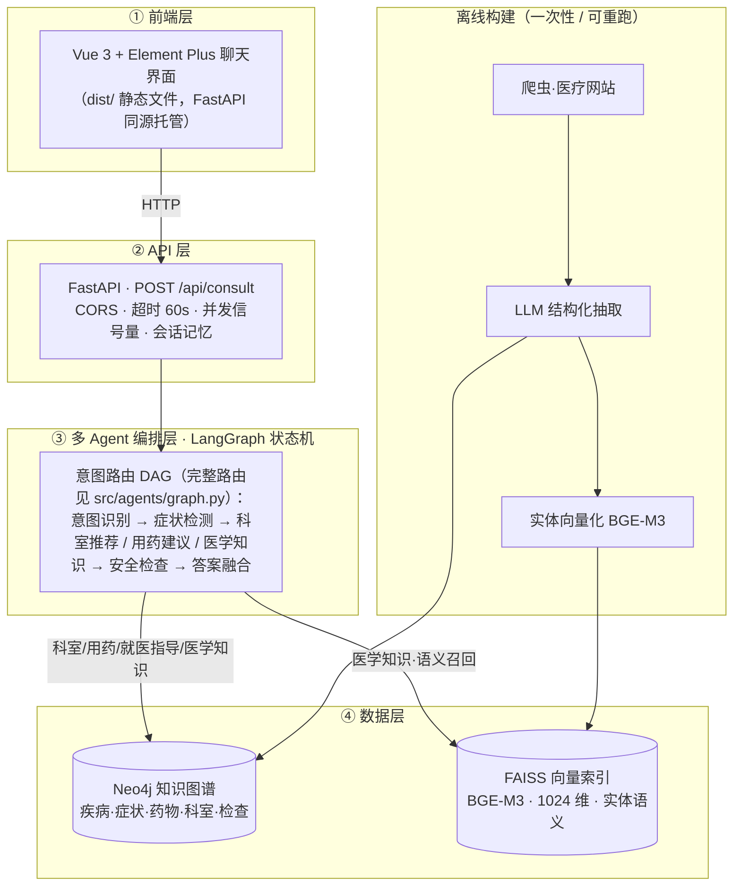

# 智慧问诊Agent系统 - 技术设计文档 (TDD)

## 0. 工程规范（契约与验收）

> **本章定位**：本 TDD 是 AI 生成器（Claude Code）的**系统约束 + 验收清单**。本章每条规范满足两个条件：
> ① **结构性约束**——违规在写法上就不成立（导入枚举，而非手敲字符串）；
> ② **自动化验收**——每条规范附可执行检查，由 AI 在生成后自行运行（`python scripts/check_contracts.py`）。
>
> **学生用法**：不需要背诵规范。每条 Vibe Coding 指令开头固定写一句——
> 「严格遵守 TDD.md 第 0 章工程规范 R1–R8，生成后运行自检，全绿才算完成」。

### 0.1 为什么需要工程规范（Vibe Coding 的漂移问题）

AI 逐模块生成代码，每个模块内部永远自洽；但同一个名字如果活在多处（Schema 定义 / 抽取提示词 / 建图模板 / 查询语句 / 存量数据），多轮迭代后必然漂移。

**真实事故（本项目）**：关系类型名规范化迁移只改了代码层，存量 Neo4j 数据未迁移（库里仍是 `BELONG_TO_DEPARTMENT`，代码查询 `BELONGS_TO_DEPARTMENT`）→ 科室推荐的图谱查询全部静默返空（日志 `kg=[]` + Neo4j 警告 `relationship type is not in the database`）→ 所有回答退化为纯 LLM 兜底，效果与通用大模型无异。

**规范的定位**：一致性类 bug（名字 / 字段 / 维度 / 数据与代码漂移）恰恰是零基础学生完全无法调试的类别——规范的目标是让这类 bug **在诞生当天死亡**。

### R1 单一事实来源（Single Source of Truth）

**约束**：

1. 节点类型、关系类型**只允许**定义在 `src/knowledge_graph/schema.py` 的 `NodeType` / `RelationType` 枚举中；意图类型只在 `src/agents/state.py` 的 `IntentType`。
2. 其他所有文件（抽取 prompt、建图模板、查询方法、Cypher 拼装）一律 **import 枚举**后用 `.value` 拼装，**禁止直接书写类型名字符串**。
3. 可调参数（阈值 / 超时 / top_k / 端口）一律进 `config/settings.py`，禁止散落魔法数字。

**验收**：

```bash
python scripts/check_contracts.py --r1
# 1) 历史错误名扫描：BELONG_TO_DEPARTMENT / TREATED_BY_DRUG / TREATED_BY（非 _MEDICATION 后缀）等出现即报错
# 2) 枚举定义位置检查：除 schema.py / state.py 外不允许出现 Enum 类型定义
# 3) 未知名字扫描：代码中出现枚举之外的 SCREAMING_SNAKE 类型名 → 告警
```

### R2 契约先行与生成顺序

**约束**：模块必须按契约依赖顺序生成，下游生成时**先 import 已存在的契约文件**，不允许引入契约之外的新类型名 / 字段名；确需扩展时，**先改契约文件，再重新生成下游**。

```
schema.py（名字契约）→ extraction/（抽取，产出契约内类型）→ graph_builder（按契约写库）
→ graph_queries（按契约读库）→ vector_store（索引字段契约）→ agents/ → api/（接口契约）→ frontend/
```

**验收**：R1 + R5 检查全绿（见下）。

### R3 前后端字段契约

**约束**：接口字段**只在 `src/api/models.py` 实现**；前端按契约表逐字段消费；字段增删改必须**先更新本表**再动代码。

**契约表（本项目现行）**：

| 接口 / 通道                             | 字段                                                                | 类型             | 生产方                     | 前端消费位置         |
| --------------------------------------- | ------------------------------------------------------------------- | ---------------- | -------------------------- | -------------------- |
| POST /api/consult 请求                  | query                                                               | str              | 前端输入                   | —                   |
|                                         | session_id                                                          | str              | 前端生成                   | —                   |
| /api/consult 响应（也是 SSE answer 帧） | answer                                                              | str              | answer_fusion              | ChatMessage 正文     |
|                                         | intent                                                              | str              | intent_classifier          | 元信息意图标签       |
|                                         | symptoms                                                            | list[str]        | symptom_detector           | 症状 el-tag          |
|                                         | departments                                                         | list[str]        | department_recommender     | 科室 el-tag          |
|                                         | medications                                                         | list[dict]       | medication_advisor         | 药物 el-tag          |
|                                         | disclaimers                                                         | list[str]        | safety_checker（强制）     | 黄色免责块           |
|                                         | warnings                                                            | list[str]        | safety_checker             | 红色急症 alert       |
|                                         | linked_entities                                                     | list[dict]       | medical_knowledge 实体链接 | 「知识定位」标签     |
|                                         | duration_ms                                                         | int              | API 层                     | 元信息耗时           |
| SSE progress 帧                         | node / label / facts                                                | str / str / dict | routes（NODE_LABELS_ZH）   | ChatMessage 进度轨迹 |
| SSE error 帧                            | message                                                             | str              | routes                     | 前端错误提示         |
| GET /api/health                         | status / neo4j_connected / vector_index_loaded / agent_system_ready | str / bool×3    | AppState                   | 侧栏状态灯           |
| GET /api/stats                          | knowledge_graph / vector_index / api                                | dict×3          | 各数据源                   | （预留）             |

**验收**：

```bash
python scripts/check_contracts.py --r3
# 前端 data.<字段> 引用了 models.py 不存在的字段 → 错误
# models.py 提供但前端从未消费的字段 → 告警（如新增字段忘了接）
```

### R4 索引与嵌入契约

**约束（数值契约，改动须同步本表）**：

| 契约项                 | 值                                  | 权威位置                                                                                      |
| ---------------------- | ----------------------------------- | --------------------------------------------------------------------------------------------- |
| 嵌入模型               | BGE-M3                              | `models/bge-m3`，`settings.embedding_model_path`                                          |
| 向量维度               | **1024**                      | `models/bge-m3/config.json` 的 `hidden_size`；`scripts/build_index.py` 的 `dimension` |
| 索引类型               | IndexIVFFlat + METRIC_INNER_PRODUCT | `scripts/build_index.py`（向量必须 `normalize_embeddings=True`）                          |
| entities.json 条目结构 | `{name, type, data}`              | `data/indexes/entities.json`，下标与索引向量一一对应                                        |
| 相似度换算             | IP→原值；L2→`1 - d/2`           | `VectorRetriever._distance_to_similarity`                                                   |

**验收**：

```bash
python scripts/check_contracts.py --r4
# 断言：index.d == 1024 == config.json hidden_size；len(entities.json) == index.ntotal；条目键齐全
```

### R5 数据即产物（Rebuild over Migration）

**约束**：Neo4j 图内容、FAISS 索引、`data/` 下全部 JSON 均声明为**代码的构建产物**。任何契约变更（R1–R4 涉及的名字 / 字段 / 维度改动）的修复流程**固定为**：

```bash
# 改完契约文件后：
python -m src.knowledge_graph.graph_builder clear     # 清空
python -m src.knowledge_graph.graph_builder build     # 重建（MERGE 幂等）
python scripts/build_index.py                         # 索引随之重建
```

**禁止**编写"兼容旧数据"的迁移 / 修补脚本（教学阶段）——学生只需理解"代码对了就重跑"，不需要理解新旧状态共存。

**验收**：

```bash
python scripts/check_contracts.py --r5
# DB 节点标签 ⊆ NodeType ∪ {Treatment, MedicalConcept}（后两者为辅助抽取类型）
# DB 关系类型 ⊆ RelationType；出现枚举之外的类型 = 错误（报错信息附 clear+build 修复指令）
# 缺失的类型 = 告警（子集属正常，由抽取数据覆盖范围决定）
```

### R6 命名公约与单向关系

**约束**：

1. 关系名采用 `动词_宾语` 大写蛇形：`HAS_SYMPTOM`、`BELONGS_TO_DEPARTMENT`、`NEEDS_EXAMINATION`。
2. **一个事实只用一个方向表达**；反向语义用 Cypher 反向遍历表达（如"症状找疾病”用 `MATCH (d)-[:HAS_SYMPTOM]->(s)` 反向匹配），不为同一事实新建反向关系类型——关系数量减半即漂移面减半。
3. **历史例外**：本项目保留既有反向关系 `MAY_INDICATE` / `TREATS_DISEASE` / `HANDLES_DISEASE`（已有存量数据）；新关系 / 新项目一律遵守单向原则。

### R7 模块自检条款

**约束**：TDD 各模块小节末尾必须附「生成后必跑」检查清单；AI 生成后**立即自行运行**，不绿则停下报告，不交付半成品。

**统一验收器**：`scripts/check_contracts.py`（覆盖 R1 / R3 / R4 / R5），退出码 0 = 全绿。

| 模块                                              | 生成后必跑                                            |
| ------------------------------------------------- | ----------------------------------------------------- |
| `src/extraction/`                               | `check_contracts.py --r1`；抽取产物类型集合 ⊆ 枚举 |
| `src/knowledge_graph/`                          | `check_contracts.py --r1 --r5`                      |
| `src/vector_store/`、`scripts/build_index.py` | `check_contracts.py --r4`                           |
| `src/api/`、`frontend/`                       | `check_contracts.py --r3` + `npm run build`       |
| 全模块完成后                                      | R8 黄金冒烟                                           |

### R8 黄金冒烟（端到端验收）

每完成一个模块，重跑以下命令，全绿方可继续：

```bash
python scripts/check_contracts.py              # 契约门禁（R1/R3/R4/R5）
python scripts/integration_test.py             # 四端点冒烟（health/stats/consult/consult-stream SSE 帧序）
python evals/runner.py --limit 10              # 评估门禁：disclaimer=1.0、急症召回、intent≥0.9
```

### 0.2 课堂操作流程（零基础视角）

```
1. 每条 Vibe Coding 指令开头：「严格遵守 TDD.md 第 0 章工程规范 R1–R8，生成后运行自检」
2. AI 生成模块 → AI 自己跑 check_contracts.py → 红了自己修（学生旁观即可）
3. 涉及数据的红色错误 → 修复口径只有 clear + build（R5），不写迁移补丁
4. 课末学生跑 R8 黄金冒烟 → 绿勾 → 下课
```

学生全程不需要理解"漂移"——他们只见过两种状态：**绿勾**，或 **AI 正在自己修到绿勾**。

### 0.3 规范的边界（诚实声明）

R1–R8 只能消除**一致性类** bug（名字 / 字段 / 维度 / 数据与代码漂移）；**消除不了**逻辑 / 提示词 / 数据质量类 bug——后者交给 day04 的评估驱动迭代（`evals/`）。区别在于：一致性 bug 学生完全无法调试，必须在设计期消灭；逻辑类 bug 学生"看得见"（答案不好），是可以参与调试的教学素材。

---

## 1. 技术架构

### 1.1 整体架构

系统分为**在线服务**与**离线构建**两条链路。在线：前端 → API → 多 Agent 编排 → 数据层；离线：爬虫 → LLM 抽取 → 建图 / 向量索引（一次性、可重跑，在线只读）。



**各 Agent 的数据访问（哪个 Agent 查哪个库、用什么机制）**：

| Agent                           | 机制                                   | Neo4j | FAISS | 说明                                                                 |
| ------------------------------- | -------------------------------------- | :---: | :---: | -------------------------------------------------------------------- |
| 意图识别 intent_classifier      | 纯 LLM                                 |  —  |  —  | 五分类（appointment / medication / knowledge / emergency / general） |
| 症状检测 symptom_detector       | 纯 LLM                                 |  —  |  —  | 抽取症状；信息不足可置`needs_clarification`                        |
| 科室推荐 department_recommender | 确定性 LLM+图检索                      |  ✅  |  —  | Tier1 图谱（症状→疾病→科室）→ Tier2 LLM 兜底                      |
| 用药建议 medication_advisor     | 确定性 LLM+图检索                      |  ✅  |  —  | 疾病→药物                                                           |
| 就医指导 pre_visit_advisor      | 确定性 LLM+图检索                      |  ✅  |  —  | 取图谱上下文生成就医须知                                             |
| 医学知识 medical_knowledge      | **强制混合检索 + grounded 生成** |  ✅  |  ✅  | FAISS 语义召回→Neo4j 取事实；检索为空时分风险兜底                   |
| 安全检查 safety_checker         | 纯规则                                 |  —  |  —  | 免责声明 / 急症升级（不依赖 LLM）                                    |
| 答案融合 answer_fusion          | 纯 LLM                                 |  —  |  —  | 汇总各 Agent 输出 + 追问话术                                         |
| 通用对话 general_chat           | 纯 LLM                                 |  —  |  —  | 非医疗闲聊                                                           |

> **机制选型**：检索模式固定的 Agent（科室/用药/就医指导）用**确定性 LLM+图检索**（快、省、可审计）；只有问法开放、可能多跳的**医学知识**分支用 FAISS+Neo4j **混合检索**，且检索为**强制必经**——医疗场景要求答案可溯源，不允许模型跳过检索凭空作答。

### 1.2 架构说明

**分层设计**：

1. **用户界面层**：Vue 3 + Element Plus 聊天应用，负责用户交互
2. **API 服务层**：FastAPI REST API，负责请求路由和参数校验
3. **Agent 系统层**：LangGraph 多 Agent 编排，负责业务逻辑
4. **数据访问层**：Neo4j 知识图谱 + FAISS 向量索引，负责数据存储和检索

**设计原则**：

- 前后端分离：Vue 前端通过 HTTP 调用 FastAPI（生产模式前端构建为静态文件由 FastAPI 同源托管）
- 模块化设计：每个 Agent 职责单一，易于测试和维护
- 可扩展性：新增 Agent 不影响现有系统
- 安全性：所有医疗建议强制添加免责声明
- 可溯源（强制检索）：医学知识问答**必须先检索知识库再作答**；检索为空时诚实兜底——一般知识标注"非本系统知识库内容"，用药相互作用/剂量等高风险直接建议咨询医生/药师，杜绝幻觉
- 确定性优先：检索模式固定的环节用确定性流水线，仅在开放问答分支引入 Agent 式工具调用，**不滥用 ReAct**（以确定性/可审计性换取不必要的"自主性"是反模式）
- 在线/离线分离：图谱与向量索引由离线流水线构建（可重跑），在线服务只读，互不耦合
- 数据访问最小化：每个 Agent 只访问其必需的存储（仅医学知识同时用 FAISS+Neo4j），降低耦合与噪声

### 1.3 部署架构

**推荐方式：docker-compose 启动 Neo4j**（声明式、可复现、纳入版本控制）：

```bash
# 1. 启动 Neo4j（项目根目录已提供 docker-compose.yml）
docker-compose up -d

# 常用管理命令
docker-compose ps              # 查看状态
docker-compose logs -f neo4j   # 查看日志
docker-compose stop            # 停止
docker-compose down            # 删除容器（保留数据卷 neo4j_data）

# 2. 构建前端（首次或前端改动后）
cd frontend && npm run build

# 3. 启动 FastAPI（同时托管 API + 前端静态文件，单进程）
python scripts/start_api.py
# 访问 http://localhost:8000 即是完整应用

# 开发模式（可选，前端热更新）：另开终端运行 cd frontend && npm run dev，访问 http://localhost:5173
```

**快速参考：docker run 单命令启动**（等价于上面的 compose，适合临时使用）：

```bash
docker run -d --name neo4j \
  -p 7474:7474 -p 7687:7687 \
  -e NEO4J_AUTH=neo4j/12345678 \
  -v neo4j_data:/data \
  neo4j:5.26
```

> **说明**：本项目采用单进程部署 —— FastAPI 同时托管 API 与 Vue 前端静态文件，因此唯一需要容器化的基础设施是 Neo4j。`docker-compose.yml` 中 Neo4j 使用 `external` 命名卷 `neo4j_data`，与 `docker run` 创建的卷同名，数据可无缝保留。

---

## 2. 模块设计

### 2.1 项目结构

```
medical-consultation-assistant/
├── README.md                          # 项目说明
├── PRD.md                             # 产品需求文档
├── TDD.md                             # 技术设计文档
├── .env                               # 环境变量配置
├── .gitignore                         # Git 忽略文件
├── requirements.txt                   # Python 依赖
│
├── config/                            # 配置文件
│   ├── __init__.py
│   ├── settings.py                    # 全局配置（从 .env 读取）
│   └── paths.py                       # 路径配置（项目目录结构）
│
├── crawler/                           # 数据采集模块（独立数据管道）
│   ├── __init__.py
│   ├── medical_crawler.py             # 医疗网站爬虫（支持多数据源）
│   ├── data_processor.py              # 数据清洗与处理（去重、格式化、统计）
│   └── README.md                      # 爬虫使用说明
│
├── src/                               # 源代码目录（应用核心）
│   ├── __init__.py
│   │
│   ├── common/                        # 公共模块
│   │   ├── __init__.py
│   │   ├── logger.py                  # 统一日志配置（文件+控制台）
│   │   ├── llm.py                     # LLM 客户端封装
│   │   ├── neo4j_client.py            # Neo4j 数据库客户端（单例）
│   │   ├── embedding_model.py         # 向量嵌入模型（单例）
│   │   └── utils.py                   # 通用工具函数
│   │
│   ├── extraction/                    # 实体关系抽取模块
│   │   ├── __init__.py
│   │   ├── schemas.py                 # Pydantic 模型定义
│   │   ├── disease_extractor.py       # 疾病实体抽取
│   │   ├── symptom_extractor.py       # 症状实体抽取
│   │   ├── drug_extractor.py          # 药物实体抽取
│   │   └── department_extractor.py    # 科室实体抽取
│   │
│   ├── knowledge_graph/               # 知识图谱模块
│   │   ├── __init__.py
│   │   ├── schema.py                  # Neo4j Schema 定义
│   │   ├── graph_builder.py           # 图谱构建（MERGE 幂等操作）
│   │   ├── graph_validator.py         # 图谱验证（孤立节点检测）
│   │   └── graph_queries.py           # 图谱查询封装
│   │
│   ├── agents/                        # 多 Agent 系统模块（扁平结构）
│   │   ├── __init__.py
│   │   ├── state.py                   # Agent 状态定义（TypedDict）
│   │   ├── graph.py                   # LangGraph 编排（状态图）
│   │   ├── base_agent.py              # Agent 基类
│   │   ├── intent_classifier.py       # 意图识别 Agent
│   │   ├── symptom_detector.py        # 症状检测 Agent
│   │   ├── department_recommender.py  # 科室推荐 Agent
│   │   ├── medication_advisor.py      # 用药建议 Agent
│   │   ├── medical_knowledge.py       # 医学知识 Agent
│   │   ├── pre_visit_advisor.py       # 就医指导 Agent
│   │   ├── safety_checker.py          # 安全检查 Agent
│   │   ├── answer_fusion.py           # 答案融合 Agent
│   │   └── general_chat.py            # 通用对话 Agent
│   │
│   ├── vector_store/                  # 向量检索模块
│   │   ├── __init__.py
│   │   ├── vector_store.py            # 向量存储（FAISS）
│   │   ├── index_builder.py           # 索引构建
│   │   └── search.py                  # 搜索功能
│   │
│   └── api/                           # API 服务模块（扁平结构）
│       ├── __init__.py
│       ├── main.py                    # FastAPI 应用入口（含前端静态文件托管）
│       ├── routes.py                  # API 路由（问诊/健康检查/统计）
│       └── models.py                  # 请求/响应 Pydantic 模型
│
├── frontend/                          # 前端模块（Vue 3 + Element Plus 独立项目）
│   ├── index.html                     # 入口 HTML
│   ├── package.json                   # 依赖与脚本配置
│   ├── vite.config.js                 # Vite 构建配置（含 /api 代理）
│   ├── src/
│   │   ├── main.js                    # 应用入口（挂载 Element Plus）
│   │   ├── App.vue                    # 根组件
│   │   ├── api/index.js               # axios 封装（调用 FastAPI）
│   │   ├── views/ChatView.vue         # 聊天主界面
│   │   └── components/                # 组件（消息气泡、免责声明横幅）
│   └── dist/                          # npm run build 产物（静态文件，由 FastAPI 托管）
│
├── data/                              # 数据目录
│   ├── raw/                           # 原始数据（爬虫输出）
│   │   ├── diseases.json              # 爬取的原始数据
│   │   └── .crawl_checkpoint.json     # 断点续爬记录
│   ├── processed/                     # 处理后的数据（清洗后）
│   │   ├── diseases.json              # JSON 格式（程序使用）
│   │   └── diseases.xlsx              # Excel 格式（人工查看）
│   ├── knowledge_graph/               # 知识图谱中间数据
│   │   ├── entities.json              # 抽取的实体列表
│   │   ├── relations.json             # 抽取的关系列表
│   │   └── .extraction_checkpoint.json # 抽取断点记录
│   └── indexes/                       # FAISS 索引
│       ├── faiss.index                # 向量索引文件
│       └── entities.json              # 实体元数据
│
├── models/                            # 本地模型文件
│   └── bge-m3/                        # BGE-M3 嵌入模型
│
├── logs/                              # 日志目录
│   ├── crawler.log                    # 爬虫日志
│   ├── extraction.log                 # 实体抽取日志
│   ├── graph_builder.log              # 图谱构建日志
│   └── api.log                        # API 服务日志
│
├── scripts/                           # 脚本目录（入口点）
│   ├── run_crawler.py                 # 运行爬虫
│   ├── run_extraction.py              # 运行实体抽取
│   ├── build_graph.py                 # 构建知识图谱
│   ├── build_index.py                 # 构建向量索引
│   ├── start_api.py                   # 启动 API 服务（同时托管前端静态文件）
│   └── validate_environment.py        # 环境验证
│
└── tests/                             # 测试目录
    ├── unit/                          # 单元测试
    │   ├── test_crawler.py
    │   ├── test_extractor.py
    │   └── test_agents.py
    └── integration/                   # 集成测试
        ├── test_graph_builder.py
        └── test_api.py
```

### 2.2 项目结构设计说明

#### 2.2.1 为什么爬虫模块在根目录？

**设计决策**：`crawler/` 放在项目根目录，而不是 `src/crawler/`

**原因**：

1. **职责分离**：爬虫是**数据管道工具**，不是应用的一部分
   - 爬虫独立运行，不依赖 FastAPI 或 Agent 系统
   - 爬虫的输出（data/raw/）是其他模块的输入
2. **运行独立性**：爬虫可以单独运行，无需启动整个应用
3. **符合数据工程实践**：在数据科学项目中，数据采集通常与数据处理、模型训练分离

**对比**：

```
❌ 不推荐：src/crawler/          # 爬虫混在应用代码中
✅ 推荐：  crawler/              # 爬虫独立，职责清晰
```

#### 2.2.2 为什么需要统一日志模块？

**设计决策**：添加 `src/common/logger.py` 统一日志配置

**原因**：

1. **避免重复配置**：每个模块都配置 logging 会导致日志格式不一致
2. **集中管理**：所有日志输出到 `logs/` 目录，便于查看和排查问题
3. **多输出目标**：同时输出到文件和控制台，文件用于持久化，控制台用于实时查看
4. **日志轮转**：自动按日期或大小轮转日志文件，避免单个文件过大

**使用示例**：

```python
# src/common/logger.py
import logging
from pathlib import Path
from config.paths import LOGS_DIR

def setup_logger(name: str, log_file: str = None) -> logging.Logger:
    """配置日志记录器"""
    logger = logging.getLogger(name)
    logger.setLevel(logging.INFO)
  
    # 控制台输出
    console_handler = logging.StreamHandler()
    console_handler.setFormatter(
        logging.Formatter("%(asctime)s [%(levelname)s] %(message)s")
    )
    logger.addHandler(console_handler)
  
    # 文件输出（可选）
    if log_file:
        log_path = LOGS_DIR / log_file
        file_handler = logging.FileHandler(log_path, encoding="utf-8")
        file_handler.setFormatter(
            logging.Formatter("%(asctime)s [%(levelname)s] %(name)s - %(message)s")
        )
        logger.addHandler(file_handler)
  
    return logger

# 使用方式
from src.common.logger import setup_logger
logger = setup_logger("crawler", "crawler.log")
logger.info("Starting crawler...")
```

#### 2.2.3 为什么用 data_processor.py 而不是 data_parser.py？

**设计决策**：使用 `data_processor.py` 而不是 `data_parser.py`

**命名对比**：

| 名称                    | 含义                                 | 适用场景                  |
| ----------------------- | ------------------------------------ | ------------------------- |
| `parser`（解析器）    | 从一种格式转换为另一种格式           | HTML → JSON, CSV → Dict |
| `processor`（处理器） | 更广泛，包含清洗、去重、格式化、验证 | 数据清洗、标准化、统计    |

**实际代码做的工作**：

```python
class DataProcessor:
    def remove_duplicates(self):    # 去重
    def clean_text(self):           # 文本清洗
    def clean_records(self):        # 记录清洗
    def generate_statistics(self):  # 统计分析
    def save_json(self):            # 保存 JSON
    def save_excel(self):           # 保存 Excel
```

**结论**：`processor` 更准确，因为不仅仅是解析，还包含清洗、去重、统计等处理逻辑

#### 2.2.4 为什么需要 config/paths.py？

**设计决策**：添加 `config/paths.py` 集中管理路径配置

**原因**：

1. **避免硬编码**：路径分散在各个模块中，修改困难
2. **跨平台兼容**：使用 `pathlib.Path` 自动处理 Windows/Mac/Linux 路径差异
3. **易于测试**：测试时可以用临时目录替换路径

**示例**：

```python
# config/paths.py
from pathlib import Path

# 项目根目录
PROJECT_ROOT = Path(__file__).parent.parent

# 数据目录
DATA_DIR = PROJECT_ROOT / "data"
DATA_RAW_DIR = DATA_DIR / "raw"
DATA_PROCESSED_DIR = DATA_DIR / "processed"
DATA_INDEXES_DIR = DATA_DIR / "indexes"

# 模型目录
MODELS_DIR = PROJECT_ROOT / "models"
BGE_M3_DIR = MODELS_DIR / "bge-m3"

# 日志目录
LOGS_DIR = PROJECT_ROOT / "logs"

# 创建目录（如果不存在）
for dir_path in [DATA_RAW_DIR, DATA_PROCESSED_DIR, DATA_INDEXES_DIR, LOGS_DIR]:
    dir_path.mkdir(parents=True, exist_ok=True)
```

**使用方式**：

```python
# 在任何模块中使用
from config.paths import DATA_RAW_DIR, LOGS_DIR

# 读取数据
input_file = DATA_RAW_DIR / "diseases.json"

# 写入日志
log_file = LOGS_DIR / "crawler.log"
```

#### 2.2.5 其他改进

| 改进点                               | 说明                                              |
| ------------------------------------ | ------------------------------------------------- |
| **添加 `.gitignore`**        | 排除敏感文件（.env）、大文件（models/）、临时文件 |
| **添加 `logs/` 目录**        | 集中存储日志文件，便于排查问题                    |
| **添加 `crawler/README.md`** | 爬虫使用说明，降低使用门槛                        |
| **添加 `graph_queries.py`**  | 封装常用 Neo4j 查询，供 Agent 调用                |
| **添加 `utils.py`**          | 通用工具函数（如文本清洗、格式转换）              |
| **完善 `data/` 子目录**      | 明确 raw/processed/indexes 的用途和文件结构       |

### 2.3 核心模块详细说明

#### 模块 1：公共模块 (`src/common/`)

**职责**：提供全局共享的基础功能

**核心类**：

```python
# config/settings.py
from pydantic_settings import BaseSettings

class Settings(BaseSettings):
    """全局配置类"""
    # LLM 配置
    model_base_url: str
    model_api_key: str
    model_name: str
  
    # Neo4j 配置
    neo4j_uri: str
    neo4j_user: str
    neo4j_password: str
  
    # 嵌入模型配置
    embedding_model_path: str
  
    # 日志配置
    log_level: str = "INFO"
  
    class Config:
        env_file = ".env"

settings = Settings()
```

```python
# common/llm.py
from langchain_openai import ChatOpenAI
from config.settings import settings

def get_llm() -> ChatOpenAI:
    """获取 LLM 客户端"""
    return ChatOpenAI(
        api_key=settings.model_api_key,
        base_url=settings.model_base_url,
        model=settings.model_name,
        temperature=0.7
    )
```

```python
# common/neo4j_client.py
from neo4j import GraphDatabase
from config.settings import settings

class Neo4jClient:
    """Neo4j 数据库客户端（单例模式）"""
    _instance = None
  
    def __new__(cls):
        if cls._instance is None:
            cls._instance = super().__new__(cls)
            cls._instance.driver = GraphDatabase.driver(
                settings.neo4j_uri,
                auth=(settings.neo4j_user, settings.neo4j_password)
            )
        return cls._instance
  
    def run(self, query: str, params: dict = None):
        """执行 Cypher 查询"""
        with self.driver.session() as session:
            result = session.run(query, params or {})
            return [record.data() for record in result]
  
    def close(self):
        """关闭连接"""
        self.driver.close()

neo4j_client = Neo4jClient()
```

```python
# common/embedding_model.py
from sentence_transformers import SentenceTransformer
from config.settings import settings

class EmbeddingModel:
    """向量嵌入模型"""
    _instance = None
  
    def __new__(cls):
        if cls._instance is None:
            cls._instance = super().__new__(cls)
            cls._instance.model = SentenceTransformer(settings.embedding_model_path)
        return cls._instance
  
    def encode(self, texts: list[str]) -> list[list[float]]:
        """文本向量化"""
        return self.model.encode(texts)

embedding_model = EmbeddingModel()
```

---

#### 模块 2：数据采集模块 (`crawler/`)

**职责**：从医疗网站采集原始数据，并进行清洗处理

**核心类**：

```python
# crawler/medical_crawler.py
import requests
from bs4 import BeautifulSoup
from typing import List, Dict, Optional
from urllib.robotparser import RobotFileParser
from tenacity import retry, stop_after_attempt, wait_exponential
import time
import random
import logging

# 随机 User-Agent 池
USER_AGENTS = [
    "Mozilla/5.0 (Windows NT 10.0; Win64; x64) AppleWebKit/537.36",
    "Mozilla/5.0 (Macintosh; Intel Mac OS X 10_15_7) AppleWebKit/537.36",
    "Mozilla/5.0 (X11; Linux x86_64) AppleWebKit/537.36",
]

class RobotsChecker:
    """检查 robots.txt 合规性"""
  
    def __init__(self):
        self.parsers = {}
  
    def is_allowed(self, url: str, user_agent: str = "*") -> bool:
        """检查 URL 是否被 robots.txt 允许"""
        # 实现 robots.txt 检查逻辑
        pass

class MedicalCrawler:
    """医疗网站爬虫（支持多数据源）"""
  
    def __init__(self):
        self.session = requests.Session()
        self.robots_checker = RobotsChecker()
        self.crawled_urls = set()
        self.diseases = []
  
    @retry(
        stop=stop_after_attempt(3),
        wait=wait_exponential(multiplier=1, min=2, max=10)
    )
    def _fetch(self, url: str) -> Optional[str]:
        """获取网页内容（带重试机制）"""
        # 检查 robots.txt
        if not self.robots_checker.is_allowed(url):
            logging.warning(f"[BLOCKED] robots.txt disallows: {url}")
            return None
    
        # 随机 User-Agent
        headers = {"User-Agent": random.choice(USER_AGENTS)}
        response = self.session.get(url, headers=headers, timeout=15)
        response.raise_for_status()
        return response.text
  
    def crawl_haodf_list(self) -> List[str]:
        """爬取好大夫在线疾病列表"""
        url = "https://www.haodf.com/jibing/"
        # 解析列表页，提取疾病详情页 URL
        pass
  
    def crawl_haodf_detail(self, url: str) -> Dict:
        """爬取好大夫在线疾病详情"""
        html = self._fetch(url)
        if not html:
            return None
    
        soup = BeautifulSoup(html, "html.parser")
        disease = {
            "name": soup.find("h1").get_text(strip=True),
            "description": "",
            "symptoms": [],
            "department": "",
            "treatment": "",
            "source": "haodf.com",
            "url": url
        }
        # 解析详情页，提取各字段
        return disease
  
    def run(self, max_diseases: int = 500, use_backup: bool = True, use_predefined: bool = True):
        """运行爬虫"""
        # 1. 爬取好大夫在线（预定义 500 种常见疾病种子列表 + 列表页发现）
        # 2. 如果数据不足，爬取寻医问药（备用）
        # 3. 保存结果到 data/raw/diseases.json
        pass
```

```python
# crawler/data_processor.py
import json
import pandas as pd
from pathlib import Path
from typing import Dict, List
import logging

from config.paths import DATA_RAW_DIR, DATA_PROCESSED_DIR

class DataProcessor:
    """数据清洗与处理"""
  
    def __init__(self):
        self.raw_data = []
        self.cleaned_data = []
        self.stats = {
            "total_raw": 0,
            "duplicates_removed": 0,
            "empty_removed": 0,
            "cleaned": 0,
        }
  
    def load_raw_data(self) -> bool:
        """加载原始数据"""
        input_file = DATA_RAW_DIR / "diseases.json"
        if not input_file.exists():
            logging.error(f"Raw data file not found: {input_file}")
            return False
    
        with open(input_file, "r", encoding="utf-8") as f:
            data = json.load(f)
    
        self.raw_data = data.get("diseases", [])
        self.stats["total_raw"] = len(self.raw_data)
        return True
  
    def remove_duplicates(self):
        """去除重复数据（按疾病名称）"""
        seen_names = set()
        unique_data = []
    
        for disease in self.raw_data:
            name = disease.get("name", "").strip()
            if not name or name in seen_names:
                self.stats["duplicates_removed"] += 1
                continue
            seen_names.add(name)
            unique_data.append(disease)
    
        self.raw_data = unique_data
  
    def clean_text(self, text: str) -> str:
        """清洗文本：去除多余空格和特殊字符"""
        if not text:
            return ""
        text = " ".join(text.split())
        # 去除特殊字符，保留中文、英文、数字、标点
        import re
        text = re.sub(r'[^\w\s一-鿿，。、；：！？""''（）《》]+', '', text)
        return text.strip()
  
    def generate_statistics(self) -> Dict:
        """生成数据统计"""
        from collections import Counter
    
        # 按来源统计
        source_counter = Counter(d["source"] for d in self.cleaned_data)
    
        # 统计症状
        all_symptoms = []
        for d in self.cleaned_data:
            all_symptoms.extend(d.get("symptoms", []))
        symptom_counter = Counter(all_symptoms)
    
        # 字段覆盖率
        fields = ["description", "symptoms", "department", "treatment"]
        coverage = {}
        for field in fields:
            count = sum(1 for d in self.cleaned_data if d.get(field))
            coverage[field] = f"{count}/{len(self.cleaned_data)}"
    
        return {
            "total": len(self.cleaned_data),
            "by_source": dict(source_counter),
            "unique_symptoms": len(symptom_counter),
            "field_coverage": coverage,
        }
  
    def save_json(self):
        """保存为 JSON 格式"""
        output_file = DATA_PROCESSED_DIR / "diseases.json"
        output = {
            "metadata": {
                "total_diseases": len(self.cleaned_data),
                "stats": self.stats,
            },
            "diseases": self.cleaned_data,
        }
        with open(output_file, "w", encoding="utf-8") as f:
            json.dump(output, f, ensure_ascii=False, indent=2)
  
    def save_excel(self):
        """保存为 Excel 格式（人工查看）"""
        output_file = DATA_PROCESSED_DIR / "diseases.xlsx"
        df = pd.DataFrame(self.cleaned_data)
        # 转换列表字段为字符串
        df["symptoms"] = df["symptoms"].apply(lambda x: "、".join(x) if x else "")
        df.to_excel(output_file, index=False, sheet_name="Diseases")
  
    def process(self) -> bool:
        """运行完整的数据处理流程"""
        # 1. 加载原始数据
        # 2. 去重
        # 3. 清洗
        # 4. 统计
        # 5. 保存 JSON + Excel
        pass
```

**数据格式**：

```json
{
  "name": "高血压",
  "description": "高血压是指以动脉血压持续升高为特征的慢性病...",
  "symptoms": ["头痛", "头晕", "心悸", "视力模糊"],
  "department": "心血管内科",
  "treatment": "药物治疗、生活方式调整",
  "source": "haodf.com",
  "url": "https://www.haodf.com/jibing/gaoxueya.htm",
  "crawled_at": "2026-07-24T10:30:00"
}
```

**使用方法**：

```bash
# 1. 运行爬虫（默认 --max 500，寻医问药备用源默认开启）
python crawler/medical_crawler.py

# 2. 清洗数据
python crawler/data_processor.py

# 3. 查看结果
# data/processed/diseases.json  (JSON 格式，程序使用)
# data/processed/diseases.xlsx  (Excel 格式，人工查看)
```

---

#### 模块 3：实体关系抽取模块 (`src/extraction/`)

**职责**：使用 LLM 从原始文本中提取结构化实体和关系

**核心类**：

```python
# extraction/schemas/disease.py
from pydantic import BaseModel, Field
from typing import List

class DiseaseEntity(BaseModel):
    """疾病实体"""
    name: str = Field(description="疾病名称")
    symptoms: List[str] = Field(description="症状列表")
    causes: List[str] = Field(description="病因列表")
    treatments: List[str] = Field(description="治疗方法")
    departments: List[str] = Field(description="就诊科室")
    examinations: List[str] = Field(description="检查项目")
    body_parts: List[str] = Field(description="影响的身体部位")
    description: str = Field(description="疾病描述")
```

```python
# extraction/disease_extractor.py
from langchain.prompts import ChatPromptTemplate
from langchain.output_parsers import PydanticOutputParser
from src.common.llm import get_llm
from src.extraction.schemas.disease import DiseaseEntity

class DiseaseExtractor:
    """疾病实体抽取器"""
  
    def __init__(self):
        self.llm = get_llm()
        self.parser = PydanticOutputParser(pydantic_object=DiseaseEntity)
    
        self.prompt = ChatPromptTemplate.from_messages([
            ("system", """你是一个医学信息抽取专家。请从以下文本中提取疾病信息，并按照指定格式输出。

输出格式：
{format_instructions}

要求：
1. 疾病名称使用标准医学术语
2. 症状列表要完整
3. 科室名称使用标准科室名称（如"心血管内科"而非"心内科"）
4. 如果没有相关信息，对应字段返回空列表"""),
            ("user", "{text}")
        ])
  
    def extract(self, text: str) -> DiseaseEntity:
        """从文本中抽取疾病实体"""
        formatted_prompt = self.prompt.format(
            text=text,
            format_instructions=self.parser.get_format_instructions()
        )
        response = self.llm.invoke(formatted_prompt)
        return self.parser.parse(response.content)
```

**提示词模板**：

```python
DISEASE_EXTRACTION_PROMPT = """
你是一个医学信息抽取专家。请从以下文本中提取疾病信息，并按照指定格式输出。

文本内容：
{text}

输出格式：
{format_instructions}

要求：
1. 疾病名称使用标准医学术语
2. 症状列表要完整
3. 科室名称使用标准科室名称（如"心血管内科"而非"心内科"）
4. 如果没有相关信息，对应字段返回空列表
"""
```

---

#### 模块 4：知识图谱模块 (`src/knowledge_graph/`)

**职责**：将结构化数据导入 Neo4j，构建医疗知识图谱

**Neo4j Schema 设计**：

**节点类型（8 种）**：

```cypher
// 疾病节点
(d:Disease {
    name: "高血压",
    description: "高血压是指...",
    created_at: timestamp()
})

// 症状节点
(s:Symptom {
    name: "头痛",
    description: "头部疼痛...",
    severity: "medium"  // low/medium/high
})

// 药物节点
(dr:Drug {
    name: "氨氯地平",
    category: "钙通道阻滞剂",
    side_effects: ["脚踝水肿", "面部潮红"],
    contraindications: ["严重低血压"]
})

// 科室节点
(dep:Department {
    name: "心血管内科",
    description: "专门治疗心脏和血管疾病"
})

// 检查节点
(e:Examination {
    name: "血压测量",
    purpose: "检测血压水平",
    preparation: "安静休息 5 分钟后测量"
})

// 治疗方案节点
(t:Treatment {
    name: "药物治疗",
    description: "使用药物控制血压"
})

// 身体部位节点
(bp:BodyPart {
    name: "心脏",
    description: "循环系统的核心器官"
})

// 医学概念节点
(mc:MedicalConcept {
    name: "血压",
    definition: "血液在血管中流动时对血管壁的压力"
})
```

**关系类型（12 种）**：

```cypher
// 疾病-症状关系
(d:Disease)-[:HAS_SYMPTOM {frequency: "common"}]->(s:Symptom)

// 症状-疾病关系（反向）
(s:Symptom)-[:MAY_INDICATE {probability: "medium"}]->(d:Disease)

// 疾病-科室关系
(d:Disease)-[:BELONG_TO_DEPARTMENT {priority: 1}]->(dep:Department)

// 疾病-药物关系
(d:Disease)-[:TREATED_BY_DRUG {evidence_level: "A"}]->(dr:Drug)

// 药物-疾病关系（反向）
(dr:Drug)-[:TREATS_DISEASE]->(d:Disease)

// 药物-副作用关系
(dr:Drug)-[:HAS_SIDE_EFFECT {frequency: "common"}]->(s:Symptom)

// 药物-药物相互作用
(dr1:Drug)-[:INTERACTS_WITH {severity: "high"}]->(dr2:Drug)

// 疾病-检查关系
(d:Disease)-[:NEEDS_EXAMINATION {necessity: "required"}]->(e:Examination)

// 疾病-身体部位关系
(d:Disease)-[:AFFECTS_BODY_PART]->(bp:BodyPart)

// 治疗方案-疾病关系
(t:Treatment)-[:FOR_DISEASE]->(d:Disease)

// 科室-疾病关系（反向）
(dep:Department)-[:HANDLES_DISEASE]->(d:Disease)

// 疾病-疾病相关关系
(d1:Disease)-[:RELATED_TO {relation_type: "complication"}]->(d2:Disease)
```

**核心类**：

```python
# knowledge_graph/graph_builder.py
from src.common.neo4j_client import neo4j_client
from typing import Dict

class GraphBuilder:
    """知识图谱构建器"""
  
    def create_indexes(self):
        """创建索引，加速查询"""
        neo4j_client.run("""
            CREATE INDEX disease_name IF NOT EXISTS
            FOR (d:Disease) ON (d.name)
        """)
        neo4j_client.run("""
            CREATE INDEX symptom_name IF NOT EXISTS
            FOR (s:Symptom) ON (s.name)
        """)
        neo4j_client.run("""
            CREATE INDEX drug_name IF NOT EXISTS
            FOR (dr:Drug) ON (dr.name)
        """)
  
    def merge_disease_node(self, disease_data: Dict):
        """创建或更新疾病节点"""
        query = """
        MERGE (d:Disease {name: $name})
        ON CREATE SET 
            d.description = $description,
            d.created_at = timestamp()
        ON MATCH SET
            d.description = $description,
            d.updated_at = timestamp()
        """
        neo4j_client.run(query, disease_data)
  
    def create_relationship(self, start_node: str, rel_type: str, end_node: str, properties: Dict = None):
        """创建关系"""
        query = f"""
        MATCH (a {{name: $start_name}})
        MATCH (b {{name: $end_name}})
        MERGE (a)-[r:{rel_type}]->(b)
        """
        if properties:
            set_clause = ", ".join([f"r.{k} = ${k}" for k in properties.keys()])
            query += f" ON CREATE SET {set_clause}"
    
        params = {
            "start_name": start_node,
            "end_name": end_node,
            **(properties or {})
        }
        neo4j_client.run(query, params)
```

---

#### 模块 5：向量检索模块 (`src/vector_store/`)

**职责**：使用 FAISS 实现语义搜索

**核心类**：

```python
# vector_store/vector_store.py
import faiss
import numpy as np
from src.common.embedding_model import embedding_model
import json

class VectorStore:
    """向量存储"""
  
    def __init__(self):
        self.index = None
        self.entities = []  # 存储实体名称
  
    def build_index(self, entities: list[dict]):
        """构建 FAISS 索引"""
        # entities: [{"name": "高血压", "type": "Disease", "description": "..."}]
        texts = [f"{e['name']} {e.get('description', '')}" for e in entities]
        embeddings = embedding_model.encode(texts)
    
        # 构建 FAISS 索引
        dimension = embeddings.shape[1]
        self.index = faiss.IndexFlatL2(dimension)
        self.index.add(np.array(embeddings))
        self.entities = entities
  
    def search(self, query: str, top_k: int = 5) -> list[dict]:
        """语义搜索"""
        query_embedding = embedding_model.encode([query])
        distances, indices = self.index.search(np.array(query_embedding), top_k)
    
        results = []
        for idx, distance in zip(indices[0], distances[0]):
            if idx < len(self.entities):
                entity = self.entities[idx].copy()
                entity["score"] = float(1 / (1 + distance))  # 转换为相似度分数
                results.append(entity)
    
        return results
  
    def save_index(self, path: str):
        """保存索引到文件"""
        faiss.write_index(self.index, f"{path}/faiss.index")
        with open(f"{path}/entities.json", "w", encoding="utf-8") as f:
            json.dump(self.entities, f, ensure_ascii=False, indent=2)
  
    def load_index(self, path: str):
        """从文件加载索引"""
        self.index = faiss.read_index(f"{path}/faiss.index")
        with open(f"{path}/entities.json", "r", encoding="utf-8") as f:
            self.entities = json.load(f)
```

---

#### 模块 6：多 Agent 系统模块 (`src/agents/`)

**职责**：使用 LangGraph 编排多个 Agent，实现智能问答

**状态定义**：

```python
# agents/state.py
from typing import TypedDict, List, Optional

class AgentState(TypedDict):
    """Agent 状态"""
    user_id: str
    session_id: str
    user_input: str
  
    # 意图识别结果
    intent: Optional[str]  # "appointment" | "treatment" | "knowledge" | "other"
  
    # 症状检测结果
    symptoms: Optional[List[str]]
    severity: Optional[str]  # "low" | "medium" | "high"
    is_emergency: Optional[bool]
  
    # 科室推荐结果
    recommended_departments: Optional[List[dict]]
  
    # 用药建议结果
    medication_advice: Optional[dict]
  
    # 医学知识回答
    knowledge_answer: Optional[str]
  
    # 就医指导
    pre_visit_advice: Optional[List[str]]
  
    # 安全检查结果
    disclaimers: Optional[List[str]]
    warnings: Optional[List[str]]
  
    # 最终回答
    final_answer: Optional[str]
  
    # 中间消息（用于调试）
    messages: List[str]
```

**Agent 实现示例**：

```python
# agents/intent/classifier.py
from langchain.prompts import ChatPromptTemplate
from langchain.output_parsers import PydanticOutputParser
from pydantic import BaseModel, Field
from src.common.llm import get_llm

class IntentResult(BaseModel):
    """意图识别结果"""
    intent: str = Field(description="意图类型：appointment/treatment/knowledge/other")
    confidence: float = Field(description="置信度：0-1")

class IntentClassifierAgent:
    """意图识别 Agent"""
  
    def __init__(self):
        self.llm = get_llm()
        self.parser = PydanticOutputParser(pydantic_object=IntentResult)
    
        self.prompt = ChatPromptTemplate.from_messages([
            ("system", """你是一个医疗问诊意图识别专家。请判断用户的意图类型：

意图类型：
1. appointment - 看病挂号：用户描述症状，想知道该挂什么科
2. treatment - 治疗建议：用户询问治疗方法或用药
3. knowledge - 医学知识：用户咨询医学概念或知识
4. other - 其他问题：非医疗相关问题

输出格式：
{format_instructions}"""),
            ("user", "{user_input}")
        ])
  
    def __call__(self, state: dict) -> dict:
        """判断用户意图"""
        formatted_prompt = self.prompt.format(
            user_input=state['user_input'],
            format_instructions=self.parser.get_format_instructions()
        )
        response = self.llm.invoke(formatted_prompt)
        result = self.parser.parse(response.content)
    
        state["intent"] = result.intent
        state["messages"].append(f"意图识别：{result.intent} (置信度: {result.confidence})")
    
        return state
```

```python
# agents/detection/symptom_detector.py
from langchain.prompts import ChatPromptTemplate
from langchain.output_parsers import PydanticOutputParser
from pydantic import BaseModel, Field
from typing import List
from src.common.llm import get_llm

class SymptomResult(BaseModel):
    """症状检测结果"""
    symptoms: List[str] = Field(description="症状列表")
    severity: str = Field(description="严重程度：low/medium/high")
    is_emergency: bool = Field(description="是否为急症")

class SymptomDetectorAgent:
    """症状检测 Agent"""
  
    EMERGENCY_SYMPTOMS = [
        "胸痛", "呼吸困难", "意识丧失", "严重出血",
        "剧烈头痛", "突发视力丧失", "癫痫发作"
    ]
  
    def __init__(self):
        self.llm = get_llm()
        self.parser = PydanticOutputParser(pydantic_object=SymptomResult)
    
        self.prompt = ChatPromptTemplate.from_messages([
            ("system", """你是一个医学症状检测专家。请从用户描述中提取症状信息：

输出格式：
{format_instructions}

急症症状列表：胸痛、呼吸困难、意识丧失、严重出血、剧烈头痛、突发视力丧失、癫痫发作
如果包含急症症状，is_emergency 设为 true"""),
            ("user", "{user_input}")
        ])
  
    def __call__(self, state: dict) -> dict:
        """检测症状"""
        formatted_prompt = self.prompt.format(
            user_input=state['user_input'],
            format_instructions=self.parser.get_format_instructions()
        )
        response = self.llm.invoke(formatted_prompt)
        result = self.parser.parse(response.content)
    
        state["symptoms"] = result.symptoms
        state["severity"] = result.severity
        state["is_emergency"] = result.is_emergency
        state["messages"].append(f"症状检测：{result.symptoms} (严重程度: {result.severity})")
    
        return state
```

**LangGraph 编排**：

```python
# agents/graph.py
from langgraph.graph import StateGraph, END
from src.agents.state import AgentState
from src.agents.intent.classifier import IntentClassifierAgent
from src.agents.detection.symptom_detector import SymptomDetectorAgent
from src.agents.recommendation.department_recommender import DepartmentRecommenderAgent
from src.agents.recommendation.medication_advisor import MedicationAdvisorAgent
from src.agents.knowledge.medical_knowledge import MedicalKnowledgeAgent
from src.agents.guidance.pre_visit_advisor import PreVisitAdvisorAgent
from src.agents.safety.safety_checker import SafetyCheckerAgent
from src.agents.fusion.answer_fusion import AnswerFusionAgent
from src.agents.chat.general_chat import GeneralChatAgent

def create_medical_qa_graph():
    """创建医疗问答状态图"""
    workflow = StateGraph(AgentState)
  
    # 添加节点（Agent）
    workflow.add_node("intent_classifier", IntentClassifierAgent())
    workflow.add_node("symptom_detector", SymptomDetectorAgent())
    workflow.add_node("department_recommender", DepartmentRecommenderAgent())
    workflow.add_node("medication_advisor", MedicationAdvisorAgent())
    workflow.add_node("medical_knowledge", MedicalKnowledgeAgent())
    workflow.add_node("pre_visit_advisor", PreVisitAdvisorAgent())
    workflow.add_node("safety_checker", SafetyCheckerAgent())
    workflow.add_node("answer_fusion", AnswerFusionAgent())
    workflow.add_node("general_chat", GeneralChatAgent())
  
    # 设置入口
    workflow.set_entry_point("intent_classifier")
  
    # 添加条件边（根据意图路由）
    workflow.add_conditional_edges(
        "intent_classifier",
        lambda state: state["intent"],
        {
            "appointment": "symptom_detector",
            "treatment": "symptom_detector",
            "knowledge": "medical_knowledge",
            "other": "general_chat"
        }
    )
  
    # 看病挂号流程
    workflow.add_edge("symptom_detector", "department_recommender")
    workflow.add_edge("department_recommender", "pre_visit_advisor")
    workflow.add_edge("pre_visit_advisor", "safety_checker")
    workflow.add_edge("safety_checker", "answer_fusion")
  
    # 治疗建议流程
    workflow.add_conditional_edges(
        "symptom_detector",
        lambda state: state["intent"],
        {
            "appointment": "department_recommender",
            "treatment": "medication_advisor"
        }
    )
    workflow.add_edge("medication_advisor", "safety_checker")
  
    # 医学知识流程
    workflow.add_edge("medical_knowledge", "safety_checker")
  
    # 通用对话直接结束
    workflow.add_edge("general_chat", END)
  
    # 答案融合后结束
    workflow.add_edge("answer_fusion", END)
  
    # 编译状态图
    app = workflow.compile()
    return app

def call_langgraph_ai(user_id: str, session_id: str, user_content: str) -> str:
    """调用 LangGraph AI 系统"""
    app = create_medical_qa_graph()
  
    initial_state = {
        "user_id": user_id,
        "session_id": session_id,
        "user_input": user_content,
        "messages": []
    }
  
    final_state = app.invoke(initial_state)
    return final_state["final_answer"]
```

---

#### 模块 7：API 服务模块 (`src/api/`)

**职责**：提供 REST API 接口

**核心代码**：

```python
# api/main.py
from fastapi import FastAPI
from fastapi.middleware.cors import CORSMiddleware
from src.api.routes.consultation import router as consultation_router
from src.api.routes.health import router as health_router

app = FastAPI(
    title="智慧问诊Agent系统",
    version="1.0.0",
    description="基于知识图谱的医疗咨询系统"
)

# 添加 CORS 中间件
app.add_middleware(
    CORSMiddleware,
    allow_origins=["*"],
    allow_credentials=True,
    allow_methods=["*"],
    allow_headers=["*"],
)

# 注册路由
app.include_router(consultation_router, prefix="/api", tags=["问诊"])
app.include_router(health_router, tags=["健康检查"])

if __name__ == "__main__":
    import uvicorn
    uvicorn.run(app, host="0.0.0.0", port=8000)
```

```python
# api/routes/consultation.py
from fastapi import APIRouter
from src.api.schemas.request import ConsultationRequest
from src.api.schemas.response import ConsultationResponse
from src.agents.graph import call_langgraph_ai

router = APIRouter()

@router.post("/process", response_model=ConsultationResponse)
def process_consultation(req: ConsultationRequest):
    """处理用户问诊请求"""
    answer = call_langgraph_ai(
        user_id=req.data.user_id,
        session_id=req.data.session_id,
        user_content=req.data.user_content
    )
  
    return ConsultationResponse(
        result={
            "answer": answer,
            "timestamp": datetime.now().isoformat()
        }
    )
```

```python
# api/schemas/request.py
from pydantic import BaseModel
from typing import Dict, Any

class ConsultationData(BaseModel):
    user_id: str
    session_id: str
    user_content: str

class ConsultationRequest(BaseModel):
    data: ConsultationData
```

```python
# api/schemas/response.py
from pydantic import BaseModel
from typing import Dict, Any

class ConsultationResponse(BaseModel):
    result: Dict[str, Any]
```

---

#### 模块 8：前端模块 (`frontend/`)

**职责**：提供用户友好的聊天界面（Vue 3 + Element Plus）

**技术栈**：Vue 3（Composition API + `<script setup>`）+ Element Plus + Vite + axios

**目录结构**：

```
frontend/
├── index.html              # 入口 HTML
├── package.json            # 依赖与脚本
├── vite.config.js          # Vite 配置（含 /api 代理）
├── src/
│   ├── main.js             # 应用入口（挂载 Element Plus）
│   ├── App.vue             # 根组件
│   ├── api/index.js        # axios 封装（调用 FastAPI）
│   ├── views/ChatView.vue  # 聊天主界面
│   └── components/         # 消息气泡、免责声明横幅等组件
└── dist/                   # npm run build 产物（由 FastAPI 托管）
```

**核心代码**：

```javascript
// frontend/src/api/index.js —— axios 封装
import axios from 'axios'

const http = axios.create({ baseURL: '/api', timeout: 30000 })

export function consult(query, sessionId) {
  return http.post('/consult', { query, session_id: sessionId })
}
```

```vue
<!-- frontend/src/views/ChatView.vue —— 聊天主界面（节选） -->
<template>
  <div class="chat-app">
    <!-- 免责声明横幅（常驻顶部） -->
    <el-alert type="warning" :closable="false"
      title="本系统仅供健康咨询和就医指导，不能替代专业医疗诊断。身体不适请及时就医，切勿自行用药！" />

    <!-- 消息列表 -->
    <div class="messages" ref="listRef">
      <div v-for="(m, i) in messages" :key="i" :class="['bubble', m.role]">
        {{ m.content }}
        <!-- 推荐科室标签 -->
        <el-tag v-for="d in m.departments" :key="d" type="success">{{ d }}</el-tag>
        <!-- 急症警告 -->
        <el-alert v-for="w in m.warnings" :key="w" type="error" :title="w" />
      </div>
    </div>

    <!-- 输入框 -->
    <el-input v-model="input" :disabled="loading" @keyup.enter="send"
      placeholder="请描述您的症状或健康问题..." />
    <el-button type="primary" :loading="loading" @click="send">发送</el-button>
  </div>
</template>

<script setup>
import { ref, nextTick } from 'vue'
import { consult } from '../api'

const messages = ref([])       // 聊天历史（响应式）
const input = ref('')
const loading = ref(false)
const listRef = ref(null)

async function send() {
  if (!input.value || loading.value) return
  const query = input.value
  messages.value.push({ role: 'user', content: query })
  input.value = ''
  loading.value = true
  try {
    const { data } = await consult(query, crypto.randomUUID())
    messages.value.push({
      role: 'assistant',
      content: data.answer,
      departments: data.departments || [],
      warnings: data.warnings || []
    })
  } finally {
    loading.value = false
    nextTick(() => listRef.value?.scrollTo(0, listRef.value.scrollHeight))
  }
}
</script>
```

**部署方式**：

```bash
cd frontend && npm run build        # 产出 dist/ 静态文件
# FastAPI 中挂载（API 路由注册之后）：
# app.mount("/", StaticFiles(directory="frontend/dist", html=True))
# 单进程 :8000 同时服务 API 与前端页面
```

---

## 3. 数据流

### 3.1 整体数据流

```
医疗网站数据
    │ requests + BeautifulSoup（爬虫）
    ▼
Excel + JSON 文件（原始数据）
    │ LangChain + LLM（实体抽取）
    ▼
JSON 文件（结构化数据）
    │ Neo4j + Cypher（图谱构建）
    ▼
Neo4j 知识图谱（8 种节点，12 种关系）
    │ LangGraph + FAISS（智能问答）
    ▼
FastAPI（REST API）
    │ HTTP 请求
    ▼
Vue + Element Plus（聊天界面）→ 用户
```

### 3.2 详细数据流

#### 流程 1：数据采集与处理

```
1. 爬虫采集
   输入：医疗网站 URL
   处理：requests + BeautifulSoup 解析 HTML
   输出：原始数据（Excel + JSON）
   存储：data/raw/

2. 实体抽取
   输入：原始数据（txt/json）
   处理：LangChain + LLM 提取结构化信息
   输出：结构化数据（JSON）
   存储：data/processed/

3. 图谱构建
   输入：结构化数据（JSON）
   处理：Cypher MERGE 语句创建节点和关系
   输出：Neo4j 知识图谱
   存储：Neo4j 数据库

4. 向量索引构建
   输入：Neo4j 中的实体数据
   处理：BGE-M3 生成向量，FAISS 构建索引
   输出：FAISS 索引文件
   存储：data/indexes/
```

#### 流程 2：智能问答

```
用户输入
    │
    ▼
[Vue + Element Plus 前端]
    │ HTTP POST /api/consult
    ▼
[FastAPI 后端]
    │ 调用 call_langgraph_ai()
    ▼
[LangGraph Agent 系统]
    │
    ├─→ [意图识别 Agent]
    │     输入：用户问题
    │     输出：意图类型（appointment/treatment/knowledge/other）
    │
    ├─→ [症状检测 Agent]
    │     输入：用户问题
    │     输出：症状列表、严重程度、是否急症
    │
    ├─→ [科室推荐 Agent]
    │     输入：症状列表
    │     处理：FAISS 向量搜索 + Neo4j 图谱查询
    │     输出：推荐科室列表
    │
    ├─→ [用药建议 Agent]
    │     输入：疾病名称
    │     处理：Neo4j 图谱查询
    │     输出：药物信息、副作用、注意事项
    │
    ├─→ [医学知识 Agent]
    │     输入：用户问题
    │     处理：Neo4j 图谱查询
    │     输出：医学知识回答
    │
    ├─→ [就医指导 Agent]
    │     输入：症状、疾病
    │     输出：就医前注意事项
    │
    ├─→ [安全检查 Agent]
    │     输入：所有建议
    │     输出：免责声明、警告信息
    │
    └─→ [答案融合 Agent]
          输入：所有 Agent 的输出
          处理：整合信息，格式化输出
          输出：最终回答
    │
    ▼
[FastAPI 返回响应]
    │ HTTP Response
    ▼
[Vue 前端渲染回答]
    │
    ▼
用户看到回答
```

### 3.3 状态流转图

```
初始状态
    │
    ▼
user_input: "我最近总是头疼"
intent: null
symptoms: null
...
    │
    ▼ [意图识别 Agent]
    │
intent: "appointment"
messages: ["意图识别：appointment"]
    │
    ▼ [症状检测 Agent]
    │
symptoms: ["头疼"]
severity: "medium"
is_emergency: false
messages: [..., "症状检测：['头疼']"]
    │
    ▼ [科室推荐 Agent]
    │
recommended_departments: [
    {"name": "神经内科", "priority": "首选", "reason": "..."},
    {"name": "眼科", "priority": "备选", "reason": "..."}
]
messages: [..., "科室推荐：神经内科、眼科"]
    │
    ▼ [就医指导 Agent]
    │
pre_visit_advice: [
    "记录头痛的时间、频率",
    "就医前不要自行服用止痛药"
]
messages: [..., "就医指导：已生成"]
    │
    ▼ [安全检查 Agent]
    │
disclaimers: ["本建议仅供参考，不能替代专业医疗诊断..."]
warnings: []
messages: [..., "安全检查：已添加免责声明"]
    │
    ▼ [答案融合 Agent]
    │
final_answer: "根据您的症状描述，建议您就诊以下科室：..."
messages: [..., "答案融合：完成"]
    │
    ▼
返回最终回答
```

---

## 4. 技术选型

### 4.1 技术栈总览

| 层级       | 技术                              | 版本     | 用途            | 选型理由                                    |
| ---------- | --------------------------------- | -------- | --------------- | ------------------------------------------- |
| 网页爬虫   | requests + BeautifulSoup          | 最新     | 数据采集        | 简单易用，适合小规模爬取                    |
| 数据处理   | pandas + openpyxl                 | 最新     | Excel 读写      | 功能强大，API 友好                          |
| 大语言模型 | langchain + ChatOpenAI            | 最新     | LLM 调用        | 统一接口，支持多种 LLM                      |
| 结构化输出 | pydantic                          | v2       | 数据校验        | 类型安全，自动生成文档                      |
| 图数据库   | Neo4j                             | 5.26 LTS | 知识图谱存储    | 图数据库领导者，Cypher 语法简洁             |
| 向量检索   | sentence-transformers + FAISS     | 最新     | 语义搜索        | BGE-M3 多语言支持，FAISS 高效               |
| Agent 编排 | LangGraph                         | 最新     | 多 Agent 状态图 | LangChain 生态，易于扩展                    |
| Web API    | FastAPI + Uvicorn                 | 最新     | REST 接口       | 高性能，自动生成文档                        |
| 前端界面   | Vue 3 + Element Plus              | 最新     | 聊天界面        | 主流工程实现，构建为静态文件由 FastAPI 托管 |
| 环境配置   | python-dotenv + pydantic-settings | 最新     | 环境变量        | 类型安全，配置验证                          |

### 4.2 技术选型详细说明

#### 大语言模型：阿里云 DashScope API (qwen-plus)

**选型理由**：

- 中文能力强，适合医疗领域
- 成本相对较低
- API 兼容 OpenAI 格式，易于切换

**替代方案**：

- OpenAI GPT-4：性能更好，但成本高
- 本地部署（如 LLaMA）：隐私性好，但需要 GPU

#### 图数据库：Neo4j 5.26 LTS

**选型理由**：

- 图数据库领导者，市场占有率最高
- Cypher 查询语言简洁易懂
- 社区版免费，适合教学项目
- Docker 部署简单

**替代方案**：

- JanusGraph：开源，但配置复杂
- Amazon Neptune：云服务，但成本高

#### 向量检索：FAISS + BGE-M3

**选型理由**：

- FAISS：Facebook 开发，高效稳定
- BGE-M3：北京智源研究院开发，多语言支持，中文效果好
- 本地部署，无需网络请求

**替代方案**：

- Milvus：分布式向量数据库，适合大规模
- Pinecone：云服务，但需要网络

#### Agent 编排：LangGraph

**选型理由**：

- LangChain 生态，与现有工具无缝集成
- 状态图设计，逻辑清晰
- 支持条件边，灵活路由

**替代方案**：

- AutoGen：微软开发，多 Agent 对话
- CrewAI：角色扮演，但不够灵活

#### Web API：FastAPI

**选型理由**：

- 高性能（基于 Starlette）
- 自动生成 OpenAPI 文档
- 类型安全（基于 Pydantic）

**替代方案**：

- Flask：简单易用，但性能较低
- Django：功能全面，但较重

#### 前端界面：Vue 3 + Element Plus

**选型理由**：

- 国内 AI 产品（Dify、Coze 等）的主流前端方案，工程化程度高
- 编译型 SPA，虚拟 DOM 局部更新，性能优于 Streamlit 的全量重跑
- 构建为纯静态文件（dist/），由 FastAPI 单进程同源托管，部署极简
- Element Plus 组件库丰富，聊天界面、标签、警告框开箱即用
- 真正的前后端分离，前端可独立部署到 Nginx/CDN

**替代方案**：

- Streamlit：纯 Python 开发，但非生产级主流，性能较差
- React + Next.js：功能强大，国际主流，但学习成本较高

---

## 5. 接口设计

### 5.1 模块间接口

#### 接口 1：爬虫 → 实体抽取

**输入**：

```python
# 输入：Excel 文件路径
input_file = "data/raw/diseases.xlsx"
```

**输出**：

```python
# 输出：JSON 文件
output_file = "data/processed/disease_entities.json"

# 输出格式
[
    {
        "name": "高血压",
        "symptoms": ["头痛", "头晕", "心悸"],
        "causes": ["遗传因素", "不良生活习惯"],
        "treatments": ["药物治疗", "生活方式调整"],
        "departments": ["心血管内科"]
    }
]
```

#### 接口 2：实体抽取 → 图谱构建

**输入**：

```python
# 输入：JSON 文件
input_file = "data/processed/disease_entities.json"
```

**输出**：

```cypher
// 输出：Neo4j 数据库
MERGE (d:Disease {name: "高血压"})
MERGE (s:Symptom {name: "头痛"})
MERGE (d)-[:HAS_SYMPTOM]->(s)
```

#### 接口 3：图谱构建 → 向量检索

**输入**：

```python
# 从 Neo4j 读取实体
entities = neo4j_client.run("""
    MATCH (d:Disease)
    RETURN d.name AS name, d.description AS description
""")

# entities: [{"name": "高血压", "description": "..."}]
```

**输出**：

```python
# 构建 FAISS 索引
vector_store.build_index(entities)
vector_store.save_index("data/indexes/")
```

#### 接口 4：向量检索 → Agent 系统

**输入**：

```python
# Agent 调用向量搜索
query = "头疼"
results = vector_store.search(query, top_k=5)
# results: [{"name": "头痛", "score": 0.95}, ...]
```

**输出**：

```python
# 返回搜索结果
return results
```

### 5.2 API 接口

#### 接口 1：POST /api/process

**请求**：

```json
{
  "data": {
    "user_id": "user_01",
    "session_id": "session_01",
    "user_content": "我最近总是头疼，应该挂什么科？"
  }
}
```

**响应**：

```json
{
  "result": {
    "answer": "根据您的症状描述，建议您就诊以下科室：...",
    "timestamp": "2026-07-24T10:30:00"
  }
}
```

**错误响应**：

```json
{
  "error": {
    "code": 400,
    "message": "用户输入不能为空"
  }
}
```

#### 接口 2：GET /health

**请求**：

```
GET /health
```

**响应**：

```json
{
  "status": "ok",
  "version": "1.0.0"
}
```

### 5.3 Agent 间接口

#### Agent 状态传递

**输入状态**：

```python
state = {
    "user_id": "user_01",
    "session_id": "session_01",
    "user_input": "我最近总是头疼",
    "intent": None,
    "symptoms": None,
    "messages": []
}
```

**输出状态**（经过意图识别 Agent）：

```python
state = {
    "user_id": "user_01",
    "session_id": "session_01",
    "user_input": "我最近总是头疼",
    "intent": "appointment",
    "symptoms": None,
    "messages": ["意图识别：appointment"]
}
```

**状态流转**：

```python
# 每个 Agent 接收 state，修改 state，返回 state
def __call__(self, state: dict) -> dict:
    # 处理逻辑
    state["intent"] = "appointment"
    state["messages"].append("意图识别：appointment")
    return state
```

---

## 6. 安全设计

### 6.1 免责声明

**强制添加**：所有医疗建议都必须包含免责声明

```python
# agents/safety/safety_checker.py
DISCLAIMER = """
🔴 **重要声明**：
本建议仅供参考，不能替代专业医疗诊断。身体不适一定要去正规医院找医生看病，
千万不要自行用药或治疗！如有紧急情况，请立即就医或拨打急救电话（120）。
"""

class SafetyCheckerAgent:
    def __call__(self, state: dict) -> dict:
        state["disclaimers"] = [DISCLAIMER]
        return state
```

### 6.2 急症识别

**急症症状列表**：

```python
EMERGENCY_SYMPTOMS = [
    "胸痛", "呼吸困难", "意识丧失", "严重出血",
    "剧烈头痛", "突发视力丧失", "癫痫发作"
]

def check_emergency(symptoms: List[str]) -> bool:
    """检查是否包含急症症状"""
    return any(s in EMERGENCY_SYMPTOMS for s in symptoms)
```

**急症响应**：

```markdown
🚨 **紧急提醒**：

您描述的症状可能是急症表现，请立即就医或拨打急救电话（120）！
```

### 6.3 药物相互作用检查

```python
def check_drug_interactions(drugs: List[str]) -> List[dict]:
    """检查药物相互作用"""
    query = """
    MATCH (d1:Drug)-[:INTERACTS_WITH]->(d2:Drug)
    WHERE d1.name IN $drugs AND d2.name IN $drugs
    RETURN d1.name AS drug1, d2.name AS drug2, r.severity AS severity
    """
    return neo4j_client.run(query, {"drugs": drugs})
```

---

## 7. 测试设计

### 7.1 单元测试

```python
# tests/unit/test_extractor.py
import pytest
from src.extraction.disease_extractor import DiseaseExtractor

def test_disease_extractor():
    extractor = DiseaseExtractor()
    text = "高血压是一种常见的慢性病，症状包括头痛、头晕..."
    result = extractor.extract(text)
    assert result.name == "高血压"
    assert "头痛" in result.symptoms
```

### 7.2 集成测试

```python
# tests/integration/test_agents.py
import pytest
from src.agents.graph import call_langgraph_ai

def test_medical_qa_system():
    answer = call_langgraph_ai(
        user_id="test_user",
        session_id="test_session",
        user_content="我最近总是头疼，应该挂什么科？"
    )
    assert "神经内科" in answer or "科室" in answer
    assert "免责声明" in answer or "就医" in answer
```

### 7.3 端到端测试

```python
# tests/e2e/test_api.py
import pytest
import requests

def test_api_endpoint():
    response = requests.post(
        "http://127.0.0.1:8000/api/process",
        json={
            "data": {
                "user_id": "test",
                "session_id": "test",
                "user_content": "高血压吃什么药？"
            }
        }
    )
    assert response.status_code == 200
    assert "result" in response.json()
```

---

## 8. 部署方案

### 8.1 开发环境

```bash
# 1. 启动 Neo4j（推荐 docker-compose）
docker-compose up -d
# 或：docker start neo4j（若容器已存在）

# 2. 构建前端（首次或前端改动后）
cd frontend && npm run build

# 3. 启动 FastAPI（同时托管 API + 前端静态文件，单进程）
python scripts/start_api.py
# 访问 http://localhost:8000 即是完整应用

# 开发模式（可选）：另开终端运行 cd frontend && npm run dev，访问 http://localhost:5173
```

### 8.2 生产环境

**Docker Compose**（项目根目录的 `docker-compose.yml`，唯一容器化基础设施为 Neo4j）：

```yaml
services:
  neo4j:
    image: neo4j:5.26
    container_name: neo4j
    ports:
      - "7474:7474"
      - "7687:7687"
    environment:
      - NEO4J_AUTH=neo4j/12345678
    volumes:
      - neo4j_data:/data
    restart: unless-stopped

volumes:
  neo4j_data:
    external: true       # 复用已存在的同名卷，保留知识图谱数据
    name: neo4j_data
```

> **应用部署**：FastAPI（含前端静态文件）可用 Gunicorn + Uvicorn Worker 直接部署在宿主机或独立容器中，连接 `bolt://neo4j:7687`。前端构建产物 `frontend/dist` 由 FastAPI 同源托管，无需独立前端容器。

**启动命令**：

```bash
docker-compose up -d
```

---

## 9. 性能优化

### 9.1 向量检索优化

**批量构建索引**：

```python
# 批量处理，减少内存占用
batch_size = 1000
for i in range(0, len(entities), batch_size):
    batch = entities[i:i+batch_size]
    vector_store.build_index(batch)
```

**缓存搜索结果**：

```python
from functools import lru_cache

@lru_cache(maxsize=1000)
def search_cached(query: str, top_k: int = 5):
    return vector_store.search(query, top_k)
```

### 9.2 Neo4j 查询优化

**创建索引**：

```cypher
CREATE INDEX disease_name FOR (d:Disease) ON (d.name);
CREATE INDEX symptom_name FOR (s:Symptom) ON (s.name);
```

**使用 EXPLAIN 分析查询**：

```cypher
EXPLAIN MATCH (d:Disease {name: "高血压"})-[:HAS_SYMPTOM]->(s:Symptom)
RETURN s.name
```

---

**文档版本**：v1.0
**创建日期**：2026-07-24
**最后更新**：2026-08-24
**状态**：已完成 ✅
